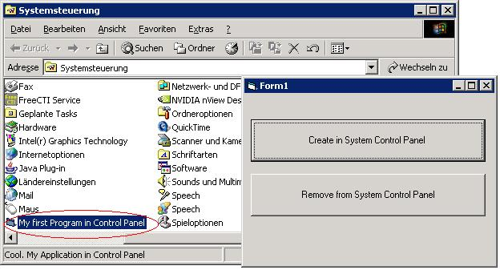



## Your Application in Windows System Control Panel

### Description

Place a Shortcut on Windows System Control Panel.

Nice for Setting up your Program.
 
### More Info
 

             |
---                |---
**Submitted On**   |2004-07-29 04:00:16
**By**             |[J\. Rostek](https://github.com/Planet-Source-Code/PSCIndex/blob/master/ByAuthor/j-rostek.md)
**Level**          |Intermediate
**User Rating**    |4.8 (67 globes from 14 users)
**Compatibility**  |VB 5\.0, VB 6\.0
**Category**       |[Coding Standards](https://github.com/Planet-Source-Code/PSCIndex/blob/master/ByCategory/coding-standards__1-43.md)
**World**          |[Visual Basic](https://github.com/Planet-Source-Code/PSCIndex/blob/master/ByWorld/visual-basic.md)
**Archive File**   |[Your\_Appli1775307292004\.zip](https://github.com/Planet-Source-Code/j-rostek-your-application-in-windows-system-control-panel__1-55225/archive/master.zip)

